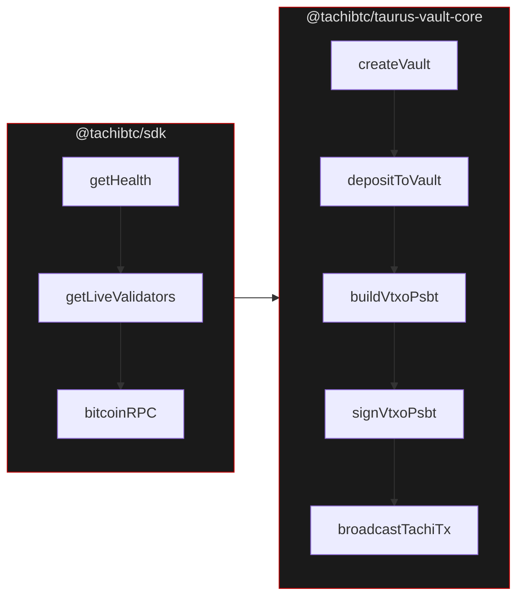

# Build Your First App on Tachi

In this tutorial you'll build a TypeScript app that:

1. Connects to the Tachi network and checks it's healthy
2. Discovers validator nodes
3. Creates a Taurus Vault (P2TR taproot address)
4. Deposits BTC into the vault
5. Builds and broadcasts a VTXO transfer

By the end you'll have touched both SDKs — `@tachibtc/sdk` for network interaction and `@tachibtc/taurus-vault-core` for vault operations.

## Setup

```bash
mkdir tachi-app && cd tachi-app
npm init -y
```

Configure npm for the `@tachibtc` scope:

```bash title=".npmrc"
@tachibtc:registry=https://npm.pkg.github.com
//npm.pkg.github.com/:_authToken=${GITHUB_TOKEN}
```

Install both SDKs:

```bash
npm install @tachibtc/sdk @tachibtc/taurus-vault-core @tachibtc/taurus-wallet-aggregator
npm install -D typescript tsx @types/node
```

Create `app.ts` — we'll build the whole thing in one file.

## Step 1: Connect and Check the Network

Start by connecting to the Tachi daemon and making sure the network is ready:

```ts
import { TachiClient } from "@tachibtc/sdk";

const tachi = new TachiClient({
  baseUrl: "https://rpc-devnet.tachibtc.com",
});

// Is the node alive?
const health = await tachi.getHealth();
console.log(`Node: ${health.status}, validators: ${health.validators}`);

// How many validators are online?
const live = await tachi.getLiveValidators();
console.log(`Live: ${live.count}/${live.total_known}`);

for (const v of live.validators) {
  console.log(`  ${v.peer_id.slice(0, 20)}... @ ${v.host}:${v.p2p_port}`);
}
```

This uses `@tachibtc/sdk` to talk to the Tachi daemon RPC. Every response is fully typed.

## Step 2: Check Bitcoin Chain State

Before creating a vault, check what's happening on the Bitcoin side:

```ts
const chainInfo = await tachi.bitcoinRPC<{
  chain: string;
  blocks: number;
}>({ method: "getblockchaininfo" });

console.log(`\nBitcoin ${chainInfo.result.chain} at block ${chainInfo.result.blocks}`);
```

The SDK proxies any Bitcoin Core RPC method through the Tachi daemon — you don't need a separate Bitcoin RPC connection.

## Step 3: Create a Wallet

Now switch to `@tachibtc/taurus-wallet-aggregator` to set up a user wallet:

```ts
import { BitcoinCoreRpcClient, WalletAggregator } from "@tachibtc/taurus-wallet-aggregator";

const rpc = new BitcoinCoreRpcClient({
  url: "http://127.0.0.1:18443", // your regtest bitcoind
});

const mnemonic =
  "abandon abandon abandon abandon abandon abandon abandon abandon abandon abandon abandon about";

const aggregator = WalletAggregator.fromMnemonic(mnemonic, {
  network: "regtest",
  rpc,
});

const userWallet = aggregator.addAccount({ addressType: "p2pkh" });
```

:::info
This example uses a test mnemonic on regtest. In production, generate a real mnemonic and never hardcode it.
:::

## Step 4: Create a Vault

This is where `@tachibtc/taurus-vault-core` comes in. A vault is a P2TR address with two spending paths — cooperative (user + KDHT nodes, instant) and exit (user alone, after timelock):

```ts
import { createVault, verifyVaultP2tr } from "@tachibtc/taurus-vault-core";

const vault = await createVault({
  network: "regtest",
  userWallet,
  validators: { endpoint: "http://127.0.0.1:26657/validators" },
  // csvBlocks: 1008, // default exit timelock
});

// Verify the taproot output was derived correctly
verifyVaultP2tr(vault.p2tr);

console.log(`\nVault address: ${vault.p2tr.address}`);
// bcrt1p... — this is where you deposit BTC
```

Under the hood, `createVault` does a lot:
- Fetches validator public keys from the KDHT endpoint
- Builds the cooperative leaf (user + 5-of-7 node multisig)
- Builds the exit leaf (1008-block CSV + user signature)
- Derives the P2TR address with a NUMS internal key (key path disabled)

## Step 5: Deposit BTC into the Vault

Fund the vault from the user's P2PKH wallet:

```ts
import { depositToVault } from "@tachibtc/taurus-vault-core";

await userWallet.sync();

const deposit = await depositToVault({
  vault,
  userWallet,
  rpc,
  amountSats: 100_000n,
  feeRateSatVb: 2,
});

console.log(`\nDeposit txid: ${deposit.txid}`);
```

The vault is now funded. The deposited BTC can only be spent through the cooperative or exit leaf.

## Step 6: Build a VTXO Transfer

With the vault funded, you can transfer value using the VTXO flow. This builds a PSBT spending the cooperative leaf:

```ts
import {
  buildVtxoPsbt,
  verifyVtxoPsbt,
  signVtxoPsbtAsUser,
  finalizeVtxoPsbt,
  buildTachiTxTransfer,
  signTachiTx,
  broadcastTachiTx,
} from "@tachibtc/taurus-vault-core";

// Build the PSBT
const built = buildVtxoPsbt({
  vault,
  inputs: [{
    txid: deposit.txid,
    vout: 0,
    valueSats: 100_000n,
    scriptPubKey: vault.p2tr.output.toString("hex"),
  }],
  outputs: [
    { address: "bcrt1p...", valueSats: 40_000n },          // recipient
    { address: vault.p2tr.address, valueSats: 59_000n },   // change back to vault
  ],
  feeSats: 1_000n,
});

// Verify — always set a fee cap
const feeOpts = { maxFeeSats: 10_000n };
verifyVtxoPsbt(built.psbt, vault, feeOpts);

// User signs
await signVtxoPsbtAsUser(built.psbt, userSigner, vault, feeOpts);

// KDHT nodes add their 5-of-7 signatures out-of-band
// ...

// Finalize the PSBT
finalizeVtxoPsbt(built.psbt, vault, feeOpts);
```

## Step 7: Broadcast to Tachi

Wrap the PSBT in a Tachi envelope and submit it:

```ts
// Wrap in Tachi transaction envelope
const draft = buildTachiTxTransfer({
  vault,
  inputs: built.inputs,
  outputs: built.outputs,
  feeSats: 1_000n,
  nonce: 0n,
  psbt: built.psbt,
});

// Sign the envelope
const tachiTx = await signTachiTx(draft, userSigner);

// Broadcast to Tachi mempool
await broadcastTachiTx(tachiTx, {
  url: "https://rpc-devnet.tachibtc.com/tachi_txBroadcastSync",
});

console.log("\nVTXO transfer broadcast!");
```

:::caution
Always use `https://` in production. For local regtest, pass `{ allowInsecureHttp: true }`.
:::

## Full Flow Recap



- **`@tachibtc/sdk`** — network queries, Bitcoin RPC proxy, transaction broadcast
- **`@tachibtc/taurus-vault-core`** — vault creation, P2TR tapscript, VTXO PSBT flow
- **`@tachibtc/taurus-wallet-aggregator`** — wallet management, key derivation

## Next Steps

- See the [SDK API Reference](/api-reference) for all 13 daemon RPC methods
- Dive into [Taurus Vault Core](/vault/overview) for vault architecture details
- Read the [VTXO Transaction Flow](/vault/vtxo) for the full build → broadcast pipeline
