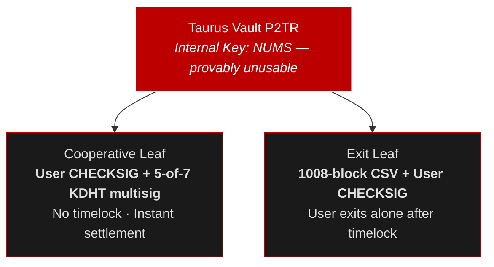

# Taurus Vault Core

On-chain building blocks for the Taurus Vault — BIP-341 P2TR address generation with a provably unusable key path (NUMS internal key) and a two-leaf tap tree for cooperative settlement and unilateral exit.

## Install

Configure npm for the `@tachibtc` scope:

```bash title=".npmrc"
@tachibtc:registry=https://npm.pkg.github.com
//npm.pkg.github.com/:_authToken=${GITHUB_TOKEN}
```

Then install:

```bash
npm install @tachibtc/taurus-vault-core @tachibtc/taurus-wallet-aggregator
```

## How Vaults Work

A Taurus Vault is a P2TR (Pay-to-Taproot) address with two spending paths:



- **Cooperative leaf** — User + 5-of-7 KDHT node multisig. No timelock, so co-signed settlement is instant.
- **Exit leaf** — 1008-block relative CSV + user signature. The user can always bail out alone after the timelock, even if nodes are offline.
- **Key path** — Disabled. The internal key is the BIP-341 NUMS point, so nobody can spend via key path.

## Quick Start

```ts
import { BitcoinCoreRpcClient, WalletAggregator } from "@tachibtc/taurus-wallet-aggregator";
import { createVault, depositToVault, verifyVaultP2tr } from "@tachibtc/taurus-vault-core";

const rpc = new BitcoinCoreRpcClient({
  url: "https://rpc-regtest.tachibtc.com/",
});

const mnemonic = "abandon abandon abandon abandon abandon abandon abandon abandon abandon abandon abandon about";

const aggregator = WalletAggregator.fromMnemonic(mnemonic, {
  network: "regtest",
  rpc,
});
const userWallet = aggregator.addAccount({ addressType: "p2pkh" });

// Create a vault — fetches validator keys automatically
const vault = await createVault({
  network: "regtest",
  userWallet,
  validators: { endpoint: "https://rpc-regtest.tachibtc.com/tachi_validators" }, // or https://rpc-signet.tachibtc.com/tachi_validators for signet
});

// Verify the P2TR output key was derived correctly
verifyVaultP2tr(vault.p2tr);

console.log(vault.p2tr.address);
// bcrt1p... ← deposit BTC here

// Fund the vault from the user's P2PKH wallet
await userWallet.sync();
const deposit = await depositToVault({
  vault,
  userWallet,
  rpc,
  amountSats: 100_000n,
  feeRateSatVb: 2,
});
console.log(deposit.txid);
```

## Supported Networks

| Network | Address Prefix | Description |
|---------|---------------|-------------|
| `mainnet` | `bc1p` | Bitcoin mainnet |
| `signet` | `tb1p` | Bitcoin signet |
| `regtest` | `bcrt1p` | Local regtest |
