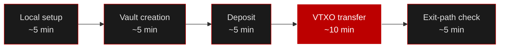

# Your First VTXO in 30 Minutes

A time-boxed, copy-paste walkthrough that takes you through the **entire vault lifecycle** on a local regtest network:



By the end you'll have created a Taurus Vault, funded it, moved value with a VTXO transfer, and **verified your unilateral exit path** — the guarantee that you can always reclaim your BTC alone, even if every KDHT node disappears.

:::info Who this is for
You just want the fast path from zero to a working VTXO. For the conceptual deep-dive, see [Taurus Vault Core](/vault/overview) and the [VTXO Transaction Flow](/vault/vtxo). For the network-RPC side of the SDK, see [Build Your First App](/tutorial).
:::

## Prerequisites

- **Node.js 18+** and **npm**
- **Bitcoin Core** (`bitcoind` / `bitcoin-cli`) for a local regtest node
- A GitHub token with `read:packages` (the `@tachibtc` packages are on GitHub Packages)

---

## Minute 0–5 · Local setup

### 1. Start a regtest bitcoind

```bash
bitcoind -regtest -daemon \
  -rpcuser=tachi -rpcpassword=tachi \
  -rpcport=18443 -fallbackfee=0.0001
```

Give yourself some spendable coins:

```bash
bitcoin-cli -regtest -rpcuser=tachi -rpcpassword=tachi \
  createwallet dev
bitcoin-cli -regtest -rpcuser=tachi -rpcpassword=tachi \
  -generate 101
```

Mining 101 blocks matures the first coinbase so it's spendable.

### 2. Scaffold the project

```bash
mkdir first-vtxo && cd first-vtxo
npm init -y
```

Install the packages you need:

```bash
npm install @tachibtc/taurus-vault-core @tachibtc/taurus-wallet-aggregator
npm install -D typescript tsx @types/node
```

Create a single `vtxo.ts` — we'll build the whole flow in one file and run it with `npx tsx vtxo.ts`.

```ts title="vtxo.ts"
import {
  BitcoinCoreRpcClient,
  WalletAggregator,
} from "@tachibtc/taurus-wallet-aggregator";

const rpc = new BitcoinCoreRpcClient({
  url: "https://rpc-regtest.tachibtc.com/",
});

// A well-known test mnemonic — NEVER use this outside regtest.
const MNEMONIC =
  "abandon abandon abandon abandon abandon abandon abandon abandon abandon abandon abandon about";

const aggregator = WalletAggregator.fromMnemonic(MNEMONIC, {
  network: "regtest",
  rpc,
});
const userWallet = aggregator.addAccount({ addressType: "p2pkh" });
```

:::warning
The mnemonic above is public. It exists only so this tutorial is reproducible. On any real network, generate a fresh mnemonic and keep it secret.
:::

---

## Minute 5–10 · Vault creation

A **Taurus Vault** is a P2TR (Taproot) address with a provably unusable key path (the BIP-341 NUMS point) and two script leaves:

- **Cooperative leaf** — you + a 5-of-7 KDHT node quorum. No timelock, so co-signed settlement is instant.
- **Exit leaf** — you alone, after a `1008`-block relative CSV timelock. This is your escape hatch.

Add this to `vtxo.ts`:

```ts
import { createVault, verifyVaultP2tr } from "@tachibtc/taurus-vault-core";

const vault = await createVault({
  network: "regtest",
  userWallet,
  validators: { endpoint: "https://rpc-regtest.tachibtc.com/tachi_validators" }, // or https://rpc-signet.tachibtc.com/tachi_validators for signet
  // csvBlocks: 1008,  // default exit-leaf timelock
});

// Re-derives both leaves, the NUMS internal key, and the tweaked
// output key. Throws on any mismatch.
verifyVaultP2tr(vault.p2tr);

console.log("Vault address:", vault.p2tr.address);
// bcrt1p... ← deposit BTC here
```

`createVault` fetches the validator pubkeys from the KDHT endpoint, builds both tapscript leaves, and derives the address. `verifyVaultP2tr` independently re-derives everything so you're never trusting an address you didn't check.

:::tip No live KDHT endpoint?
Pass keys directly with `nodePubkeys: [ /* 7 hex pubkeys */ ]` instead of `validators` to build a vault fully offline.
:::

---

## Minute 10–15 · Deposit

Fund the vault from your P2PKH wallet. `depositToVault` selects UTXOs, builds and signs the funding transaction, and broadcasts it through the RPC client.

```ts
import { depositToVault } from "@tachibtc/taurus-vault-core";

await userWallet.sync();

const deposit = await depositToVault({
  vault,
  userWallet,
  rpc,
  amountSats: 100_000n,
  feeRateSatVb: 2,
});

console.log("Deposit txid:", deposit.txid);
```

Confirm it by mining a block:

```bash
bitcoin-cli -regtest -rpcuser=tachi -rpcpassword=tachi -generate 1
```

The 100,000 sats are now locked in the vault and can only move through the cooperative or exit leaf — never the key path.

:::info Two "deposits", one word
There are two distinct steps that both get called a deposit:

1. **On-chain funding** (this step) — `depositToVault` sends BTC to the vault's P2TR address on Bitcoin.
2. **Ledger registration** (next section) — a **DEPOSIT `TachiTx`** registers that vault UTXO as a spendable `vtxoId` on the Tachi ledger.

You need both. A transfer references the `vtxoId` from step 2, so skipping it makes the transfer fail with `vtxo not found`.
:::

---

## Minute 15–25 · VTXO transfer

This is the core flow. A transfer is a PSBT that spends the **cooperative leaf**, gets signed by you and the KDHT quorum, is finalized, then wrapped in a Tachi wire envelope and broadcast to the Tachi mempool.


### 0. Derive a Schnorr signer

The aggregator signs ECDSA; VTXO spends need Schnorr. Wrap your BIP-32 leaf in the `TaprootSigner` shape once, and reuse it for every signature below:

```ts
import {
  Keystore,
  getNetwork,
} from "@tachibtc/taurus-wallet-aggregator";
import type { TaprootSigner } from "@tachibtc/taurus-vault-core";

const keystore = Keystore.fromMnemonic(MNEMONIC, "", getNetwork("regtest"), "p2pkh", 0);
const node = keystore.signerFor(false, 0); // receive, index 0 — same key the vault commits

const userSigner: TaprootSigner = {
  publicKey: Buffer.from(node.publicKey),
  sign: (h) => Buffer.from(node.sign(h)),
  signSchnorr: (h) => Buffer.from(node.signSchnorr!(h)),
};
```

### 1. Build and verify the PSBT

```ts
import {
  buildVtxoPsbt,
  verifyVtxoPsbt,
  signVtxoPsbtAsUser,
  finalizeVtxoPsbt,
} from "@tachibtc/taurus-vault-core";

const recipient = "bcrt1p..."; // any regtest Taproot address

const built = buildVtxoPsbt({
  vault,
  inputs: [{
    txid: deposit.txid,
    vout: 0,
    valueSats: 100_000n,
    scriptPubKey: vault.p2tr.output.toString("hex"),
  }],
  outputs: [
    { address: recipient, valueSats: 40_000n },          // send
    { address: vault.p2tr.address, valueSats: 59_000n }, // change back to vault
  ],
  feeSats: 1_000n,
});

// ALWAYS cap the fee so a malformed PSBT can't drain value to miners.
const feeOpts = { maxFeeSats: 10_000n };
verifyVtxoPsbt(built.psbt, vault, feeOpts);
```

### 2. Sign

You attach your Schnorr signature; the KDHT quorum contributes theirs out-of-band to reach the 5-of-7 threshold.

```ts
await signVtxoPsbtAsUser(built.psbt, userSigner, vault, feeOpts);

// The 5-of-7 KDHT nodes add their tapScriptSigs here, out-of-band.
// ...

finalizeVtxoPsbt(built.psbt, vault, feeOpts);
```

### 3. Register the VTXO on the Tachi ledger

Before you can *transfer* the vault UTXO, the Tachi ledger has to know about it. Broadcast a **DEPOSIT `TachiTx`** to mint its `vtxoId`, then wait for the commit — otherwise the transfer races the deposit and fails with `vtxo not found`.

```ts
import {
  signTachiTx,
  broadcastTachiTx,
  buildTachiTxDeposit,
  vtxoIdFromDeposit,
  waitForVtxoCommit,
} from "@tachibtc/taurus-vault-core";

const TACHI_URL = "https://rpc-regtest.tachibtc.com"; // regtest daemon
const insecure = { allowInsecureHttp: true }; // regtest only — see caution below

// Build + sign the DEPOSIT envelope (nonce 0 for this account's first action).
const depositDraft = buildTachiTxDeposit({
  userXOnly: userSigner.publicKey,
  amountSats: 100_000n,
  nonce: 0n,
  feeSats: 2n,
});
const depositTachi = await signTachiTx(depositDraft, userSigner);

await broadcastTachiTx(depositTachi, {
  url: `${TACHI_URL}/tachi_txBroadcastSync`,
  ...insecure,
});

// The vtxoId the transfer will spend.
const vtxoId = vtxoIdFromDeposit(depositTachi, 0);

// Poll until FinalizeBlock mints the vtxoId on the ledger.
await waitForVtxoCommit(vtxoId, {
  baseUrl: TACHI_URL,
  overallTimeoutMs: 60_000,
  pollIntervalMs: 1_500,
  ...insecure,
});

console.log("VTXO registered:", vtxoId.toString("hex"));
```

### 4. Wrap the transfer in a Tachi envelope and broadcast

Now build the TRANSFER envelope. It references the `vtxoId` you just minted and uses the **next nonce** (the deposit used `0`, so the transfer uses `1`):

```ts
import { buildTachiTxTransfer } from "@tachibtc/taurus-vault-core";

const draft = buildTachiTxTransfer({
  vault,
  inputs: [{
    txid: deposit.txid,
    vout: 0,
    valueSats: 100_000n,
    scriptPubKey: vault.p2tr.output.toString("hex"),
    vtxoId, // ← from the DEPOSIT TachiTx above
  }],
  outputs: built.outputs,
  feeSats: 1_000n,
  nonce: 1n, // deposit was nonce 0
  psbt: built.psbt,
});

const tachiTx = await signTachiTx(draft, userSigner);

await broadcastTachiTx(tachiTx, {
  url: `${TACHI_URL}/tachi_txBroadcastSync`,
  ...insecure,
});

console.log("VTXO transfer broadcast!");
```

:::caution
The library refuses to send Schnorr signatures over plaintext HTTP by default. `allowInsecureHttp: true` is fine for local regtest, but in production always use `https://` and drop that flag.
:::

Run the whole thing:

```bash
npx tsx vtxo.ts
```

---

## Minute 25–30 · Exit-path check

The most important guarantee of a Taurus Vault is that **you can always leave**. The exit leaf is a CSV-timelocked script committing *only* your key — after the timelock, no node cooperation is required. Before you ever trust a vault with real value, verify that leaf is exactly what you expect.

There's no "click to exit" helper on purpose — the exit path lives in the script itself, so the check is about **inspecting and confirming** it:

```ts
import { describeTapscript } from "@tachibtc/taurus-vault-core";

const { exitLeaf, exitControlBlock } = vault.p2tr;

// 1. The timelock matches what you asked for.
console.log("Exit CSV timelock:", exitLeaf.csvBlocks, "blocks");
//  → 1008  (~1 week at 10-min blocks)

// 2. The leaf commits YOUR key and only yours.
console.log("Exit leaf key === your key:",
  exitLeaf.userKey.equals(vault.userKey.xOnly));

// 3. Read the script back in human-readable form:
//    <1008> OP_CHECKSEQUENCEVERIFY OP_DROP <yourKey> OP_CHECKSIG
console.log(describeTapscript(exitLeaf.script));

// 4. A valid control block proves the leaf is really in the tap tree
//    committed by the on-chain address.
console.log("Exit control block present:", exitControlBlock.length > 0);
```

If all four checks pass, your exit is enforced by Bitcoin consensus, not by any node's goodwill. Should the KDHT quorum ever refuse to co-sign, you wait out the `csvBlocks` timelock and spend the vault UTXO alone through this leaf.

:::tip Prove it end-to-end on regtest
On regtest you can fast-forward the timelock by mining `1008` blocks (`bitcoin-cli -regtest -generate 1008`), then build a PSBT spending the `exitLeaf` with `exitControlBlock` and only your signature — no node input at all. That's the same path that protects you on mainnet, just without the wait.
:::

---

## Recap

In ~30 minutes you went from an empty directory to a full VTXO lifecycle:

| Step | Function(s) | What you proved |
|------|-------------|-----------------|
| Setup | `WalletAggregator`, `BitcoinCoreRpcClient` | A funded regtest wallet |
| Vault | `createVault`, `verifyVaultP2tr` | A two-leaf P2TR you independently re-derived |
| Deposit | `depositToVault` | BTC locked into the vault |
| Register | `buildTachiTxDeposit` → `waitForVtxoCommit` | The vault UTXO minted as a `vtxoId` on the ledger |
| Transfer | `buildVtxoPsbt` → `buildTachiTxTransfer` → `broadcastTachiTx` | Value moved via the cooperative leaf |
| Exit check | `describeTapscript`, `exitLeaf` inspection | You can always leave, alone |

## Next steps

- [VTXO Transaction Flow](/vault/vtxo) — the full build → broadcast pipeline in depth
- [Taurus Vault Core](/vault/overview) — vault architecture and tapscript internals
- [Vault API Reference](/vault/api) — every vault function and option
- [SDK API Reference](/api-reference) — the 13 daemon RPC methods for network interaction
